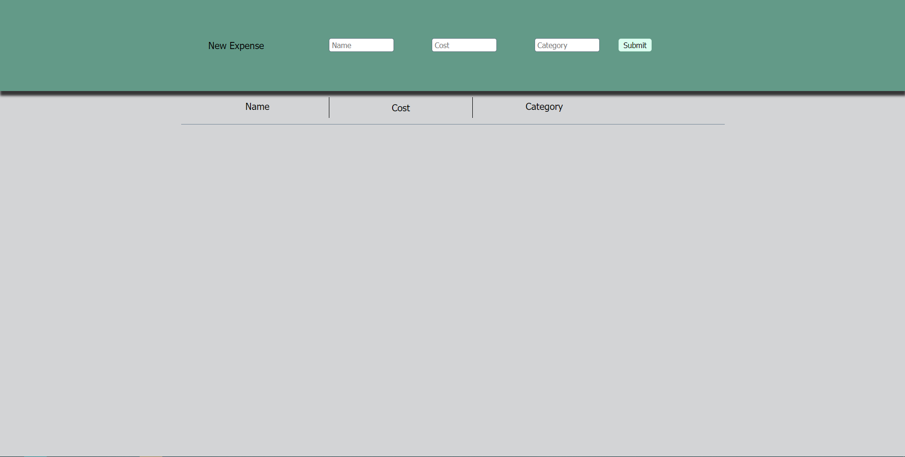
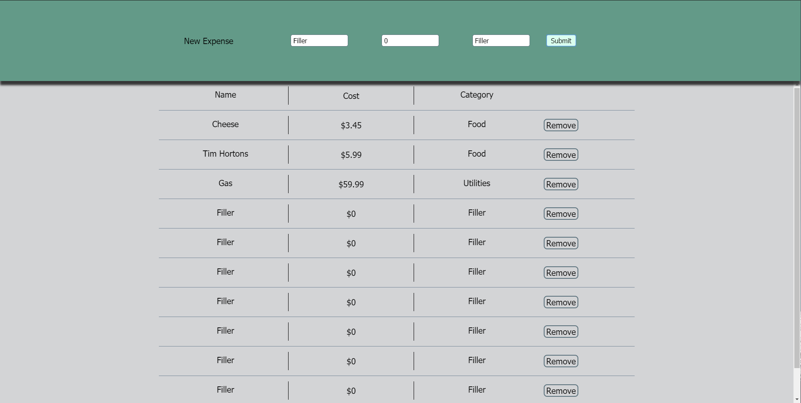

Welcome to my Expense Tracker!

This project was developed by Donovan Ollenberger-Kutzer using React and Node.js.

To run this project locally, React and Node.js must be installed on your system.

The project has been pre-compiled into a production build. To run the server, Serve must be installed by running

`npm install -g serve`

in the project directory. Then type 

`serve -s build`

At this point, the server should be running, with the local address being saved to your clipboard. Paste the address in your browser and you're good to go!

**Screenshots**

Upon loading the page

Upon adding many items to the list

